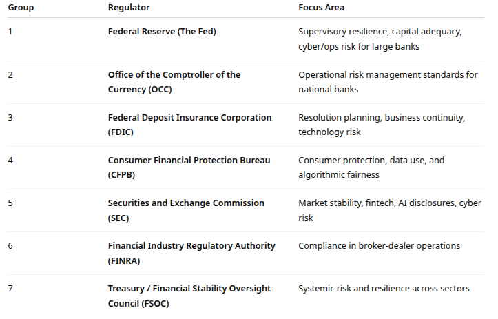

# Regulatory Agencies

This will be a longer term exercise. The goal is to identify the major regulatory agencies that impact the risk and resilience operations of US banks.

This is a preliminary overview, and we will continue to develop this exercise in more detail in the next several weeks

## Objectives

By the end of this exercise, you should be able to
- Identify the major U.S. regulatory agencies overseeing financial and banking risk.
- Explain how these agencies influence operational resilience and IT risk management.
- Compare the different mandates of regulators (prudential, consumer, systemic).
- Critically evaluate regulatory actions and enforcement cases related to risk failures or technology incidents.
- Discuss the challenges of maintaining resilience under complex regulatory oversight.

## Regulatory Overview

The U.S. banking system has a fragmented but complementary regulatory structure, involving federal and state agencies, self-regulatory bodies, and international influences (like Basel accords).

Regulators enforce:
- Operational resilience standards
- Cybersecurity and third-party risk rules
- Incident response and recovery mandates
- Model risk management (AI, algorithms)
- Data privacy and consumer protection

For this exercise, we will start with some of the major regulators

---

## Instructions

For each of the agencies on the list, identify the following
- The agency’s mandate and legal authority (relevant laws/regulations).
- The types of risks the agency monitors (operational, cyber, systemic, AI).
- Recent events or enforcement actions related to risk or resilience.
- How the agency’s rules impact IT operations (e.g., incident reporting, third-party risk, governance, data management).
- Current or emerging policy debates (AI, cloud concentration, fintech oversight, operational resilience frameworks).

Your submissions should be no more than a half a page summary in bullet point form per agency.

The report due dates are:

- Friday October 24: The Federal Reserve
- Monday October 27: OCC
- Wednesday October 29: FDIC and FINRA
- The rest are TBD
